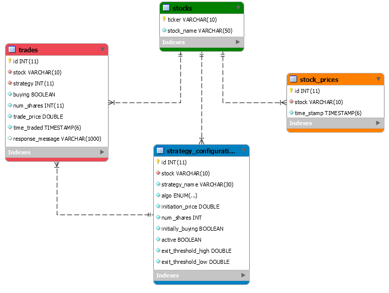

# JaveTrading Platform
### Abnob Doss | Vicki Lee | Julie Rosenbaum


## Description
Create automated trading strategies that are informed by live market data. The strategies decide when to execute trades based on algorithmic analysis of the market data.  The platform provides a trader the ability to deactivate and adjust an existing strategy, along with real-time performance statsof each strategy.


## To set environment variables for local machine
In application.properties, the variables look like this:
```
spring.datasource.url=jdbc:mysql://${DBHOST}/${DBNAME}
spring.datasource.username=${USERNAME}
spring.datasource.password=${PASSWORD}
spring.activemq.broker-url=tcp://${ACTIVEMQ}:61616
```

In Intellij:

`Edit Run Configurations...` --> In the popup select `Spring Boot` --> `ExchangeApplication` --> `Environment` --> `Environment Variables` --> Click the plus `...` next to the empty box --> In the popup click `+` to add the 5 new variables:

Name     | Value
---------|---------------
`DBHOST`   | `localhost:3306`
`DBNAME`   | `javet`
`USERNAME` | `root`
`PASSWORD` | `c0nygre`
`ACTIVEMQ` | `localhost`

Click `Ok`, and then hitting the play button should work the same!


## Runbook

1. Set the Environment Variables in the run configurations
2. Create and launch the Database
3. Launch the OrderBroker/ActiveMQ instance 
4. Run ExchangeApplication
5. Visit localhost:8085/

## Technology and Roles  
### User Interface:
* _Visualizing, creating and adding strategies and trades_ 
	* Abnob Doss
	* Developed in HTML5 and JQuery with Mustache 
 
### Core Business Logic:

* _Monitoring live market data_
	* Vicki Lee 
	* Developed in Java using Spring and a "mock" data feed server

* _Continually executing strategies based on user configurations_
	* Vicki Lee | Abnob Doss
	* Developed in Java using Spring

* _Ordering trades in the market_
	* Julie Rosenbaum
	* Developed in Java using Spring and Java Message Service (JMS)

### Persistence:

* _Maintaining a database and mapping that information to Java objects to execute strategy decisions_
	* Julie Rosenbaum 
	* Developed in Java using a Spring Data Rest app with JDBC repositories and a MySQL database

## Architecture
### Database Design


### Application Flow
Components of the application:
* Database
    * Stocks - ticker and name 
    * Stock Prices - market price of a given stock with a timestamp
    * Strategy Configurations - user inputted information for strategy - stock, price, exit threshold, etc.
    * trades
* REST API
    * Creates entities, repositories, services and controllers to represent the database mappings
    * Allows access to add, update and retrieve elements in the database via GET, POST and PUT requests
    ```
     /                            index.html - eTrading Dashboard
     └── /api
         ├── /stocks              displays all stocks
         │   └── /{ticker}        displays one stock with given ticker
         ├── /strategies          displays all strategies
         │   ├── /active          displays all strategies currently monitoring the market/executing trades
         │   └── /{id}            displays one strategy with given id
         │       ├── /profit      displays the profit of strategy by id
         │       ├── /deactivate  sends request to stop running a strategy by id
         │       ├── /position    displays position (open/closed) of strategy by id
         │       ├── /trade_evals displays current value of original investment of strategy by id
         │       └── /trades      displays all trades executed by a strategy by id
         ├── /stockprices         displays all stock prices retrieved from market feed
         │   └── /{ticker}	  
	 │       └── /latest      displays latest stock price with given ticket
         └── /trades              displays all trades executed
             └── /{id}            displays one trade with given id
    ```
* UI
    * Calls the various API links via JQuery GET requests and displays live, as well as historic, stock, price, strategy and trade data 
    * JQuery then used to intervally refresh these fields so the user sees the most up-to-date market data
    * Uses the Mustache JS library to enable large and dynamic layouts to be cached and rendered for increased performance
    * Uses JQuery POST and PUT requests to the /strategies API to allow users to edit and disable live strategies
* MockFeed and MockFeed Parser
    * MockFeed provided by Conygre at http://feed.conygre.com:8080/MockYahoo/quotes.csv?s=goog&f=p0
    	* From Conygre: stock price oscillates over a sine wave based on a hard-coded base price for each of a handful of securities (AAPL GOOG BRK-A NSC MSFT). If you request a ticker not known to the service, the base price will be 100.
    * The parser creates a scheduler to continually make GET requests to the Conygre feed
    * Inputs them to the stock_prices table
* Trade Executor
    * Takes in a trade object with the specifications of the trade
    * Constructs a JMS message to send to an ActiveMQ queue
    * Listens for a response from the OrderBroker, confirming the status of the trade
* Strategy Engine
    * Comprised of a strategy execution engine and the individual algorithms for each strategy
    * The execution engine takes in a list of active strategies
        * It continually makes calls to run the strategy algorithm based on its performance
        * Decides when to deactivate the strategy based on performance
        * Calculates performance analytics
    * The individual strategy algorithms handle the logic of the financial strategy
        * Takes in all active strategies of this algorithm (currently only TMA)
        * Decides when to execute trades based on the strategy configurations passed in
    

## Approach
### Steps to Achieve MVP
 1. Design database (ongoing as project progresses)
 2. Build REST API / persistence mappings using Spring Data 
 3. Build a service to retrieve live stock prices from MockYahoo market data feed
 4. Build a web interface (ongoing as more components are developed)
 5. Obtain approval from client on layout and functionality
 6. Build messaging system to contact OrderBroker and execute trades
 7. Build engine to start a Strategy scheduler
 8. Design first strategy algorithm Two Moving Averages (TMA)
 9. Implement algorithm with trade execution 
 10. Improve UI to populate with live information
 11. Debug and add missing features to achieve minimum viable product
 12. Publish Docker image to production and deploy
 13. Retroactively test
 14. Complete stretch goals ...
 
 
### Stretch Goals
- [x] View all trades by strategy
- [x] Graph for live stragetgy perfromance
- [x] Add historical stock price/strategy data 
- [ ] Implement the other two strategies: Bollinger Bands and Price Breakout
- [ ] Searching for strategies
- [ ] Ability to re-activate an old strategy with the same configurations
- [ ] Handling partial fills and rejections from the OrderBroker


## Retrospective
### What Went Well 
* Teamwork and communication: convened several times during the day for progress updates
* Accomplishing set goals in a timely manner
* Merging those separated components
* Structured our process well by ordering most important tasks first
    * Successful first day of planning to set foundation
    * Separation of work was efficient - rarely multiple people working on the same task, with the exception of the strategy logic
* Continuous Integration as we merged components  
* Good interactions with Production Support and other teams to focus our issues     

### What Went Wrong
* Lack of testing   
    * Shelved in the interest of time to complete a fully functional minimum viable product, but its value was obvious as we progressed
    * Encountered errors throughout integration of the various components that perhaps wouldn't have existed with thorough planning and testing
* More code review to avoid duplicating functionality and making workflow more streamlined
* Add documentation to the code to make clear each class/function's purpose and use case
* Lack of business knowledge - spent a long time on the strategy and debugging the logic
* Lack of understanding of certain development tools
    * Peer programming was excessive when debugging
    * JPA mappings with Spring were confusing and unintuitive
    * Separating out the different modules of the project: UI from API from Algorithm Engine
    * Docker was a nightmare for everyone ; due to our own lack of understanding along with Prod Support's own issues                                                                                           
* Timing! Not enough time in a week that would have allowed us to solve these issues
    
### What To Improve If Repeated
* Test Driven Development and Behavior Driven Development
* Architecture planning in the beginning
* Studying the technology tools more in depth
* Using git more effectively (though for our purposes we did not need as many features)
* Task management tools (though again not needed for the timeframe alotted)
* Using business analysts/experts for the core business logic
* Understand deployment more thoroughly, and start the interaction with Prod Support earlier to ensure smooth transition

### Lessons Learned
* Anything is possible if you just _believe_
    * Started feeling insecure in our skillset and business knowledge, but it all came together quickly when we focused our efforts and had daily goals set and realized
* Value of teamwork: trusting in your team members' contributions
* Better to have error messages than to be blindly debugging
    * Testing would be helpful here too
* Ask for help from other teams, supervisors and of course teammates instead of wasting time 
* Huge improvements were made in our own understanding the tools we studied

